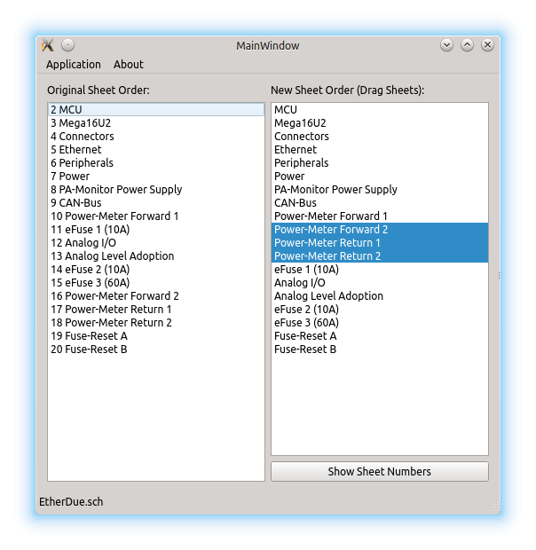

# KiCad Sheet Rearranger
Simple tool for defining a certain oder of multiple sub-sheets in a schematic project



## Usage
* Load root schematic file of your KiCad project
* drag and drop your sheets in the right list until you are happy
* preview the new sheet numbers by pressing the button `Show Sheet Numbers`
* Save it

## Compilation
It's written with Qt and should compile easily:  
```
qmake
make
```
